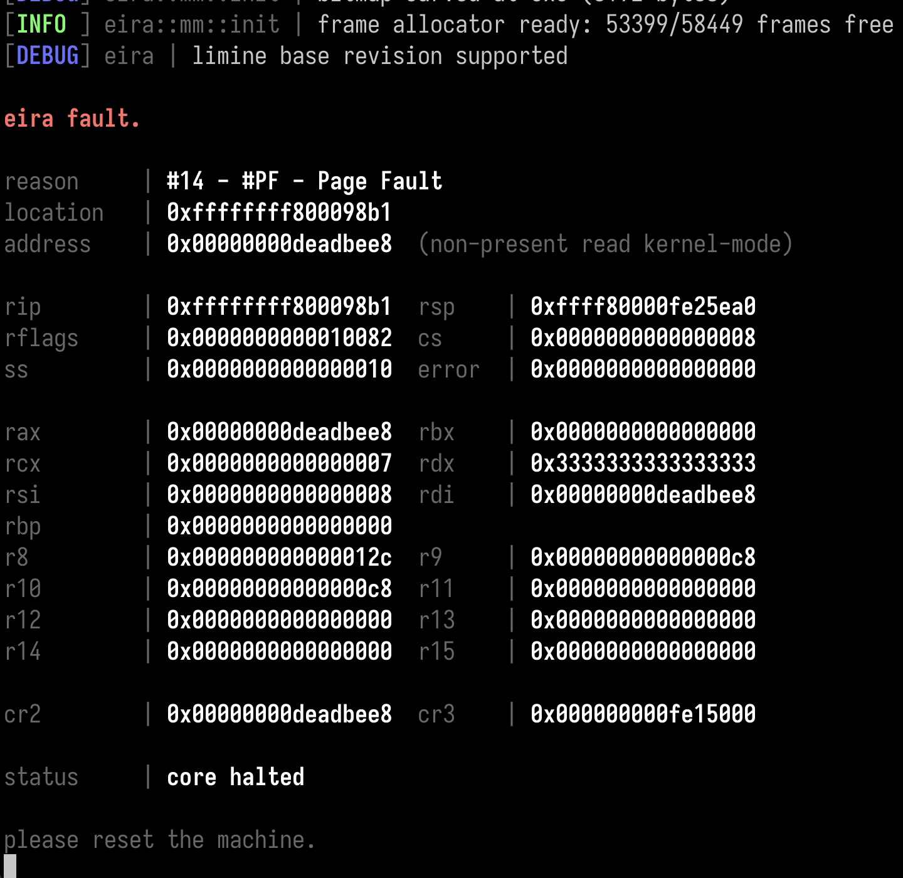
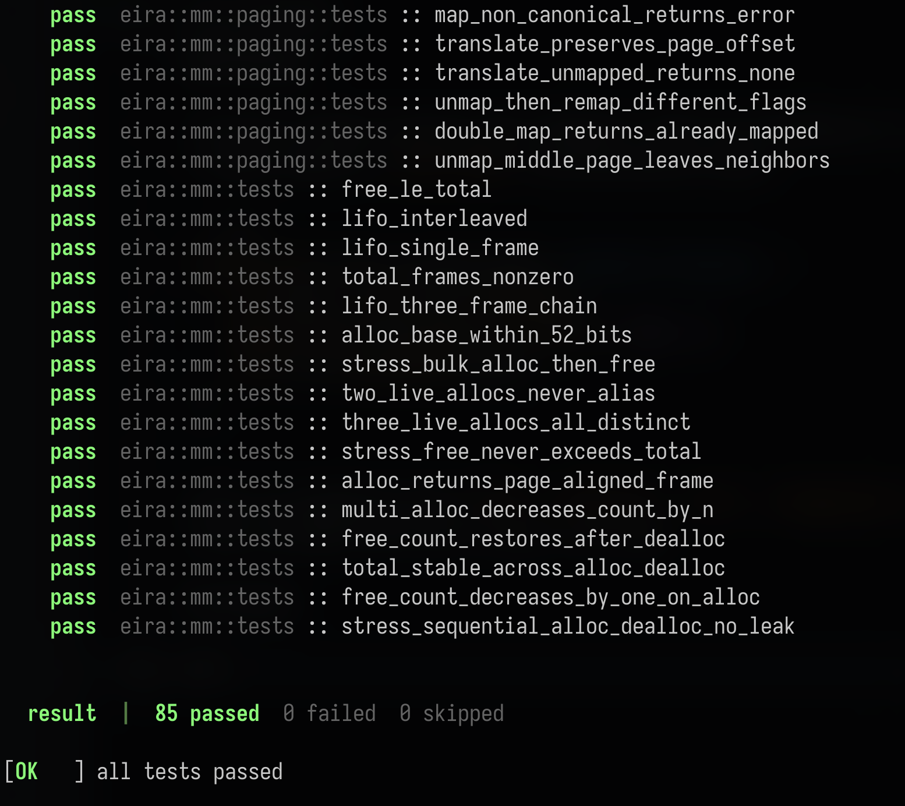

<div align="center">

# eira


*a microkernel, built from scratch, in [rust](https://rust-lang.org/).*

</div>

---

## what is eira?

eira is a microkernel written in rust. targets both x86_64 and aarch64 systems.

## getting started

### prerequisites

- nightly rust
- `qemu-system-x86_64` and/or `qemu-system-aarch64`

### running

```sh
# run the kernel in qemu
cargo xtask run

# run with tests
cargo xtask test
```

### testing

eira has a custom in-kernel test framework. tests are registered at compile time via
a linker section (`.test_cases`) and discovered at boot.

```rust
kernel_test!(frame_is_page_aligned, TestKind::Physical, {
    let frame = mm::allocate();
    kassert_eq!(frame.base().as_usize() % 4096, 0);
    mm::deallocate(frame);
});
```

tests run grouped by kind (`Unit`, `Physical`, `Arch`, `Integration`), results are printed to
serial and qemu exits with a code ci can read.

## gallery





## license

[mit](LICENSE)
